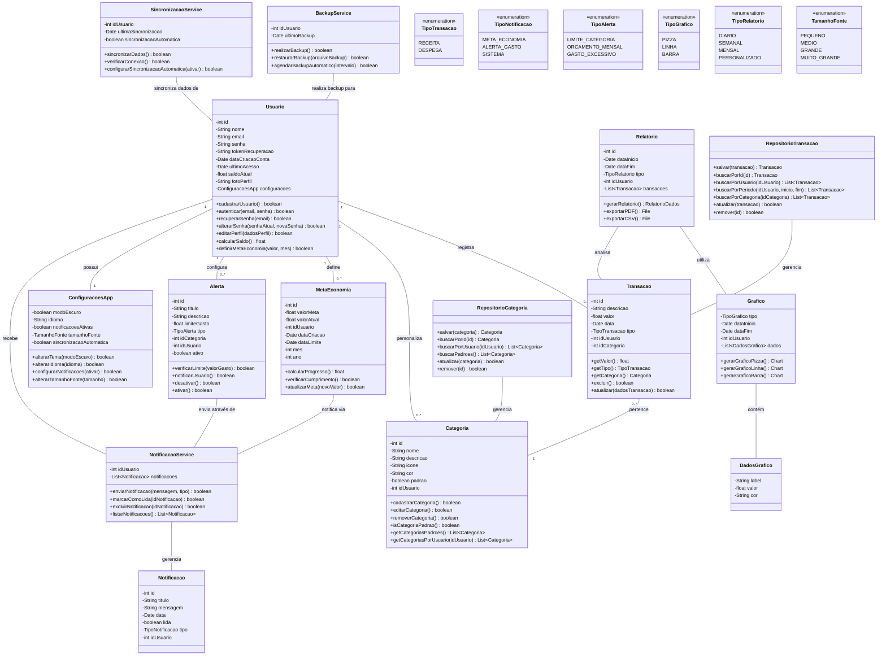

# Diagrama de Classes - Aplicativo de Controle Financeiro Pessoal

## Visão Geral do Sistema

Este documento apresenta o diagrama de classes UML para um aplicativo de controle financeiro pessoal, baseado nos requisitos especificados. O diagrama ilustra as principais entidades, seus atributos, métodos e relacionamentos, fornecendo uma visão estrutural completa do sistema.

## Diagrama de Classes UML

## Descrição das Classes Principais

### Classes de Entidade
1. **Usuario**: Gerencia informações de perfil e autenticação do usuário.
2. **Transacao**: Representa as operações financeiras (receitas e despesas) do usuário.
3. **Categoria**: Define classificações para transações, podendo ser padrão ou personalizada.
4. **MetaEconomia**: Armazena objetivos financeiros estabelecidos pelo usuário.
5. **Alerta**: Configura notificações para controle de gastos.

### Classes de Serviço
1. **NotificacaoService**: Gerencia o sistema de notificações.
2. **BackupService**: Realiza operações de backup e restauração de dados.
3. **SincronizacaoService**: Sincroniza dados entre dispositivos e servidor.

### Repositórios
1. **RepositorioTransacao**: Persiste e recupera dados de transações.
2. **RepositorioCategoria**: Persiste e recupera dados de categorias.

### Visualização e Configuração
1. **Relatorio**: Gera relatórios financeiros customizáveis.
2. **Grafico**: Cria visualizações gráficas dos dados financeiros.
3. **ConfiguracoesApp**: Armazena preferências do usuário.

### Enumerações
1. **TipoTransacao**: Define tipos de transação (RECEITA, DESPESA).
2. **TipoNotificacao**: Classifica as notificações do sistema.
3. **TipoAlerta**: Define tipos de alertas financeiros.
4. **TipoGrafico**: Especifica tipos de gráficos disponíveis.
5. **TipoRelatorio**: Define períodos para relatórios financeiros.
6. **TamanhoFonte**: Configura tamanhos de fonte da interface.

## Relacionamentos Principais

- Um usuário registra múltiplas transações (1:N)
- Um usuário personaliza múltiplas categorias (1:N)
- Cada transação pertence a uma categoria (N:1)
- Um usuário define múltiplas metas de economia (1:N)
- Um usuário configura múltiplos alertas (1:N)
- Um usuário possui uma configuração de aplicativo (1:1)

## Funcionalidades Implementadas

O diagrama contempla as seguintes funcionalidades do aplicativo:

1. **Autenticação de Usuários**: Login, cadastro e recuperação de senha
2. **Gestão de Transações**: Registro de receitas e despesas
3. **Categorização**: Criação e gestão de categorias personalizadas
4. **Análise Financeira**: Gráficos e relatórios
5. **Metas e Alertas**: Definição de objetivos e notificações de gastos
6. **Personalização**: Interface adaptável (modo claro/escuro)
7. **Segurança de Dados**: Backup e sincronização

---

Elaborado por: [Nome do Desenvolvedor: Cezarino M. Hora/Equipe: Grupo 01 - Cezarino, Eduarda, Laura e Guilherme]
Data: 13 de abril de 2025
